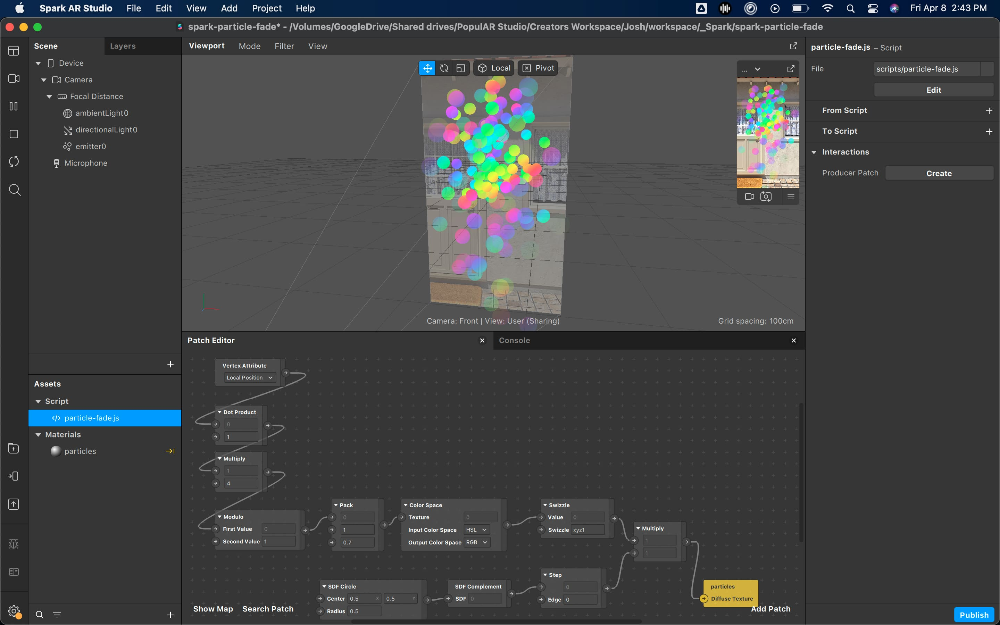

# Spark AR Particle Fader Example

This project demonstrates how to fade alpha over the lifespan of a particle. In other words, your particles will fade away instead of suddenly popping out of existence!

## Downloads

Here's a direct link to the script: [particle-fade.js](./scripts/particle-fade.js)

Or you can download the [particle fade demo project](https://github.com/Popul-AR/spark-particle-fade/archive/refs/heads/master.zip)

